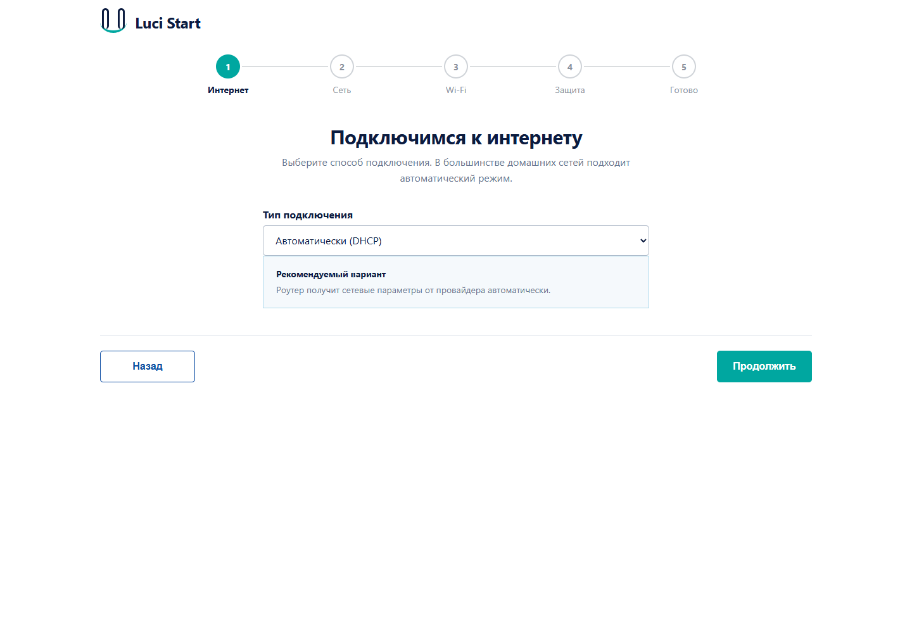
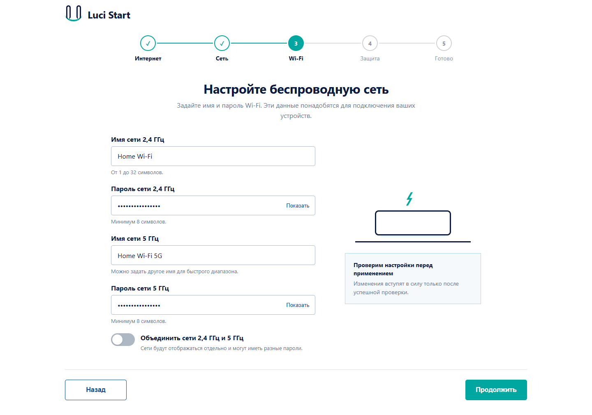
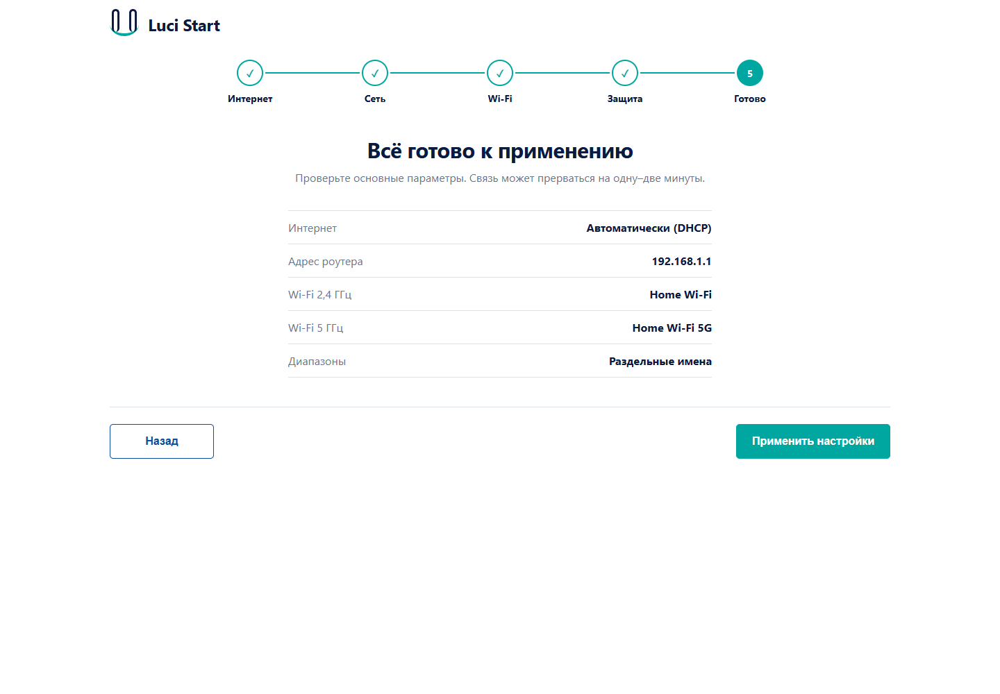

# luci-app-wizard — Luci Start

Русскоязычный мастер быстрой настройки OpenWrt с интерфейсом в стиле домашних роутеров. Пять последовательных шагов помогают настроить подключение к интернету, адрес локальной сети, Wi-Fi и пароль администратора, затем проверить выбранные параметры.

## Возможности

- WAN: DHCP или статический IPv4, маска, шлюз и DNS.
- LAN: адрес роутера с предупреждением о переподключении.
- Wi-Fi: общее имя и пароль либо отдельные имена и пароли для двух сетей.
- Кнопки показа паролей и базовая проверка ввода.
- Необязательная смена пароля администратора.
- Итоговый обзор перед применением.
- Повторный ручной запуск через «Быстрый старт»; обычный вход открывает стандартную страницу LuCI.
- Кнопка «Назад» на первом шаге закрывает мастер. Повторный запуск не создаёт ожидающих изменений UCI.

## Скриншоты

Снимки локальной демонстрации настоящего интерфейса с вымышленными данными. Мастер наследует основные цвета, фон, шрифт и стиль кнопок активной темы LuCI, поэтому органично выглядит и с темой Material, и с другими темами, использующими стандартные переменные LuCI.

### Подключение к интернету


### Две сети Wi-Fi с отдельными паролями


### Проверка перед применением


## Установка

Для OpenWrt 25.12 на `ramips/mt7621` доступен нативный APK. После его установки `luci-app-wizard` отображается в «Установленных пакетах» LuCI. Архив с shell-установщиком оставлен как запасной способ установки на совместимых системах.

Требуются OpenWrt с LuCI, rpcd, UCI и команда install. Интерфейс проверялся на D-Link DIR-882 A1 с OpenWrt 25.12.0. Работа на других моделях и полный цикл применения с потерей связи пока не проверены.

Скачайте `luci-app-wizard_0.1.0-r1_mipsel_24kc.apk` из [Releases](https://github.com/Sensat10on/luci-app-wizard/releases), передайте на роутер в `/tmp` и выполните по SSH:

```sh
apk add --allow-untrusted /tmp/luci-app-wizard_0.1.0-r1_mipsel_24kc.apk
```

Для другой архитектуры используйте исходники и GitHub Actions: сборка уже настроена под `ramips/mt7621` и производит корректный APK v3. Существующая конфигурация `lucistart` сохраняется.

Откройте «Быстрый старт» или `http://192.168.1.1/cgi-bin/luci/admin/lucistart` (подставьте адрес вашего роутера).

## Ограничения предварительной версии

Мастер рассчитан на обычную конфигурацию с интерфейсами `wan`, `lan` и двумя AP. Диапазоны пока сопоставляются по порядку AP-секций: первая — 2,4 ГГц, следующая — 5 ГГц. Применение затрагивает все AP-секции и устанавливает WPA2/WPA3 mixed (`sae-mixed`); гостевые сети и сложные конфигурации требуют отдельной доработки. PPPoE и VLAN в мастере не реализованы. Проверки адресов и паролей базовые. Не заявляется проверенная поддержка автоматического восстановления связи при смене LAN.

Перед применением сохраните резервную копию настроек через LuCI. После установки модуля действующие сетевые параметры сами по себе не меняются.

## Удаление

```sh
sh /tmp/luci-app-wizard/uninstall.sh
```

Конфигурация `/etc/config/lucistart` сохраняется. При установке APK удаление доступно и в «Установленных пакетах» LuCI.

## Исходники

`htdocs/` содержит JavaScript/CSS; `root/` — меню, ACL и конфигурацию. `Makefile` предназначен для размещения в дереве LuCI. GitHub Actions создаёт проверяемый APK v3 для OpenWrt 25.12 `ramips/mt7621`.
